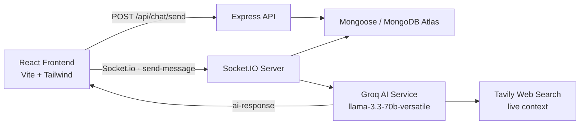

<div align="center">

<!-- Logo -->
<picture>
  <source media="(prefers-color-scheme: dark)" srcset="https://placehold.co/120x120/9333EA/ffffff?text=MOGO&font=roboto">
  
</picture>

# 🤖 MOGO AI — Real-Time AI Chat Application

**A lightning-fast, full-stack AI chat assistant powered by Groq Llama 3.3, Tavily Web Search, Socket.IO & MongoDB.**

[](https://nodejs.org)
[](https://expressjs.com)
[](https://socket.io)
[](https://www.mongodb.com)
[](https://react.dev)
[](https://vite.dev)
[](https://tailwindcss.com)
[](https://groq.com)
[](./LICENSE)

</div>

---

## ✨ Introduction

**MOGO AI** is a modern, production-style full-stack chat application that brings a conversational AI to your browser in **real-time**. It pairs the **ultra-fast Groq inference engine** with **Tavily live web search** so MOGO doesn't just answer — it *answers with fresh, real-world context*. Every conversation is persisted as a **session** in MongoDB Atlas and streamed instantly to the UI over **WebSockets (Socket.IO)**.

> 👋 "Hi! My name is MOGO. How can I help you today?"

---

## 🚀 Features

### 🧠 AI Engine
- ⚡ **Groq-powered** — `llama-3.3-70b-versatile` delivers near-instant responses.
- 🌐 **Live Web Search** — Tavily automatically injects up-to-date context into every prompt (RAG-style).
- 🧬 **MOGO Persona** — A warm, friendly assistant that introduces itself and even switches to Hindi/Hinglish greetings.

### 🔌 Real-Time Communication
- ⚡ **WebSocket Streaming** via Socket.IO — no polling, no page refreshes.
- 🔄 **Optimistic UI** — messages appear instantly while the AI is thinking.
- 🎯 **Typing Indicator** — animated dots while MOGO generates a response.

### 💾 Data Persistence
- 🗂️ **Session-based chats** — each conversation is a MongoDB document with its own auto-generated title.
- 📜 **Full history** — revisit any past conversation from the sidebar.
- 🔁 **Auto-title** — first message becomes the conversation title (trimmed to 30 chars).

### 🎨 Frontend Experience
- 🖥️ **Responsive UI** — desktop + mobile, with a collapsible history sidebar.
- 💬 **Chat bubbles** — clean, modern styling with a custom **MOGO 3D robot avatar**.
- ⌨️ **Enter-to-send**, mic button, gradient send button, and smooth auto-scroll.
- 🧮 **React 19 + useReducer** — predictable state, `useMemo`/`useCallback` optimizations.

---

## 🛠️ Tech Stack

### Backend
| Layer | Technology |
|---|---|
| Runtime | [Node.js](https://nodejs.org) (ES Modules) |
| Framework | [Express.js](https://expressjs.com) 5.x |
| Real-Time | [Socket.IO](https://socket.io) 4.x |
| AI Inference | [Groq SDK](https://groq.com) — `llama-3.3-70b-versatile` |
| Web Search | [Tavily](https://tavily.com) (`@tavily/core`) |
| Database | [MongoDB Atlas](https://www.mongodb.com) via [Mongoose](https://mongoosejs.com) 9.x |
| Utilities | `dotenv`, `cors`, `morgan` |

### Frontend
| Layer | Technology |
|---|---|
| Framework | [React 19](https://react.dev) |
| Build Tool | [Vite](https://vite.dev) 8.x |
| Styling | [Tailwind CSS](https://tailwindcss.com) 4.x (`@tailwindcss/vite`) |
| HTTP Client | [Axios](https://axios-http.com) |
| Icons | [lucide-react](https://lucide.dev) |
| Realtime Client | `socket.io-client` |

---

## 🏗️ Architecture



**Flow:** The frontend sends a prompt → Express/Socket.IO forwards it to the **AI Service** → the service fetches live context from **Tavily**, builds a system prompt with the **MOGO persona**, calls **Groq** → the answer is emitted back over the socket (and via REST) → the exchange is saved to **MongoDB**.

---

## 📂 Project Structure

```text
chat-with-ai-project/
├── backend/
│   ├── server.js                    # HTTP + Socket.IO server entry point
│   ├── package.json
│   ├── .env.example                 # Environment template (PORT, DB, API keys)
│   └── src/
│       ├── app.js                   # Express app: middlewares & routes
│       ├── config/
│       │   └── db.js                # MongoDB connection
│       ├── controller/
│       │   └── chat.controller.js   # Send message & fetch history
│       ├── model/
│       │   ├── chat.model.js        # Mongoose Chat session schema
│       │   └── ai.model.js          # Re-export helper
│       ├── routes/
│       │   └── chat.routes.js       # REST endpoints
│       ├── services/
│       │   └── ai.service.js        # Groq + Tavily + MOGO persona engine
│       └── tools/
│           └── ai.tools.js          # Tavily web-search tool
└── frontend/
    ├── index.html
    ├── vite.config.js
    ├── package.json
    └── src/
        ├── main.jsx                 # React entry
        ├── App.jsx                  # Chat UI, reducer, sidebar, sockets
        ├── App.css / index.css      # Global Tailwind styles
        └── assets/                  # MOGO avatar & icons
```

---

## 🚀 Getting Started

### ✅ Prerequisites
- **Node.js** v18+ (v20 recommended)
- A **MongoDB Atlas** cluster (free tier is enough)
- A **Groq API key** — [console.groq.com](https://console.groq.com/keys)
- A **Tavily API key** — [tavily.com](https://tavily.com)

### 1️⃣ Backend Setup

```bash
cd backend
npm install
```

Create a `.env` file inside `backend/` (copy from `.env.example`):

```env
PORT=3000
MONGODB_URL=mongodb+srv://<username>:<password>@cluster.mongodb.net/<dbname>
GROQ_API_KEY=your_groq_api_key_here
TAVILY_API_KEY=your_tavily_api_key_here
```

Start the backend:

```bash
npm run dev
```

> ✅ Server running at **http://localhost:3000** — MongoDB connected & Socket.IO ready.

### 2️⃣ Frontend Setup

```bash
cd frontend
npm install
npm run dev
```

> 🎨 App running at **http://localhost:5173**

> 💡 If your backend runs on a different port, update the base URL in `frontend/src/App.jsx`.

---

## 📡 API Reference

### REST Endpoints

| Method | Endpoint | Description | Request Body |
|---|---|---|---|
| `GET` | `/` | Health check | — |
| `POST` | `/api/chat/send` | Send a prompt to MOGO & save conversation | `{ "message": "What is Node.js?", "chatId": "optional" }` |
| `GET` | `/api/chat/history` | Fetch all conversation sessions | — |

#### `POST /api/chat/send` — Example Response

```json
{
  "success": true,
  "data": {
    "_id": "66b4cd78a8f12b3c4d5e6f7a",
    "title": "What is Node.js?",
    "messages": [
      {
        "_id": "66b4cd78a8f12b3c4d5e6f8b",
        "userMessage": "What is Node.js?",
        "aiResponse": "Node.js is an open-source, cross-platform JavaScript runtime environment...",
        "timestamp": "2026-08-08T20:16:00.000Z"
      }
    ],
    "createdAt": "2026-08-08T20:15:55.000Z",
    "updatedAt": "2026-08-08T20:16:00.000Z"
  }
}
```

### ⚡ Socket.IO Events

| Direction | Event | Payload |
|---|---|---|
| Client → Server | `send-message` | `{ message: "Explain React Hooks" }` |
| Server → Client | `receive-message` | AI response text (string) |

```javascript
// Client example
const socket = io("http://localhost:3000");

socket.emit("send-message", { message: "What is Socket.IO?" });

socket.on("receive-message", (text) => {
  console.log("MOGO says:", text);
});
```

---

## 🗺️ Roadmap

- [x] Real-time chat over WebSockets
- [x] Groq Llama 3.3 integration with live Tavily web search
- [x] Session-based chat history in MongoDB
- [x] Optimistic UI + typing indicator + responsive layout
- [ ] Streamed (token-by-token) responses
- [ ] Voice input via Web Speech API
- [ ] User authentication (JWT)
- [ ] Message editing & deletion
- [ ] Docker deployment (frontend + backend)

---

## 🤝 Contributing

Contributions are what make the open-source community amazing. To contribute:

1. 🍴 Fork the repository
2. 🌿 Create a feature branch: `git checkout -b feature/amazing-feature`
3. 💾 Commit your changes: `git commit -m 'Add amazing feature'`
4. 📤 Push: `git push origin feature/amazing-feature`
5. 🔀 Open a Pull Request

Please ensure your code follows the existing style and passes linting (`npm run lint` in the frontend).

---

## 📄 License

Distributed under the **MIT License**. See [LICENSE](./LICENSE) for more information.

---

<div align="center">

**Built with 💜 by [Prakash Das](https://github.com/kaku-coder) — MERN Stack Developer & MCA Student**

[](https://github.com/kaku-coder)
[](https://linkedin.com/in/prakash-das-8374b5296)
[](mailto:prakashdasdev1@gmail.com)

*⭐ If you found this project helpful, consider giving it a star!*

</div>
